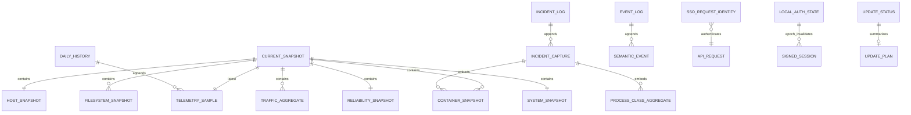
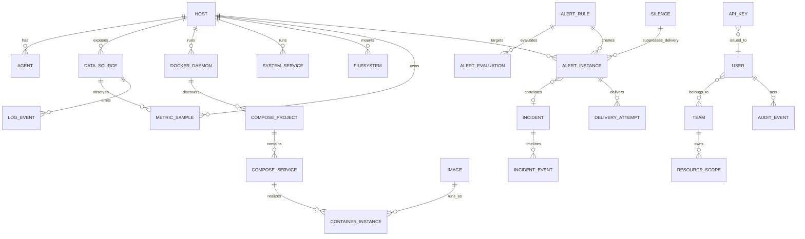
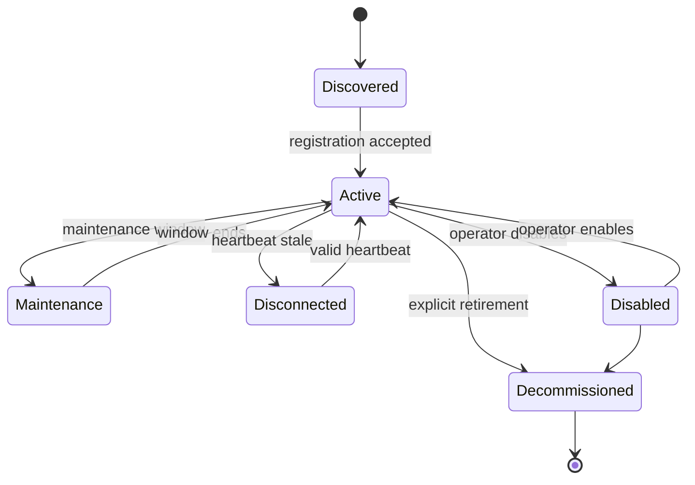
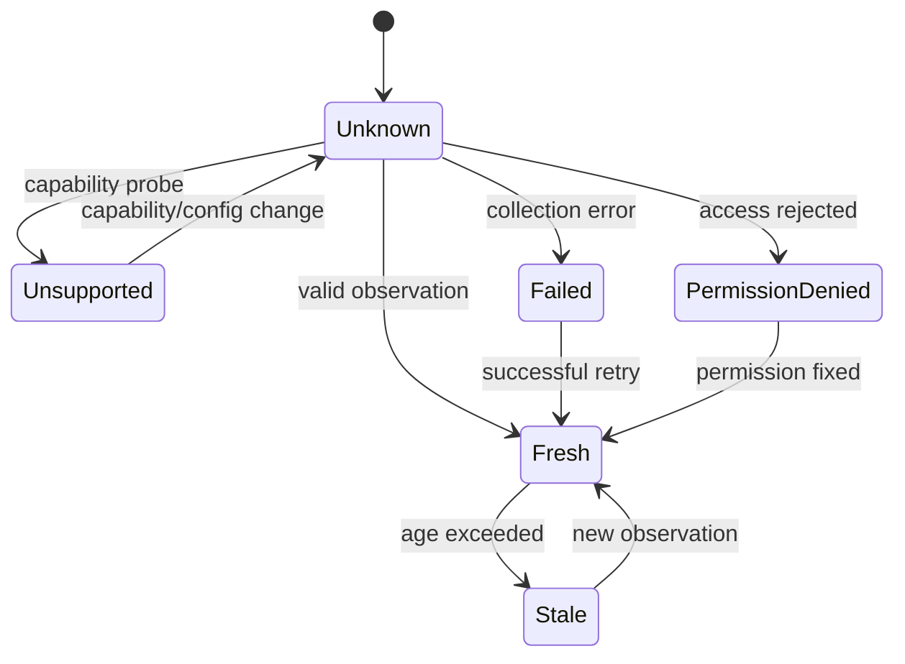
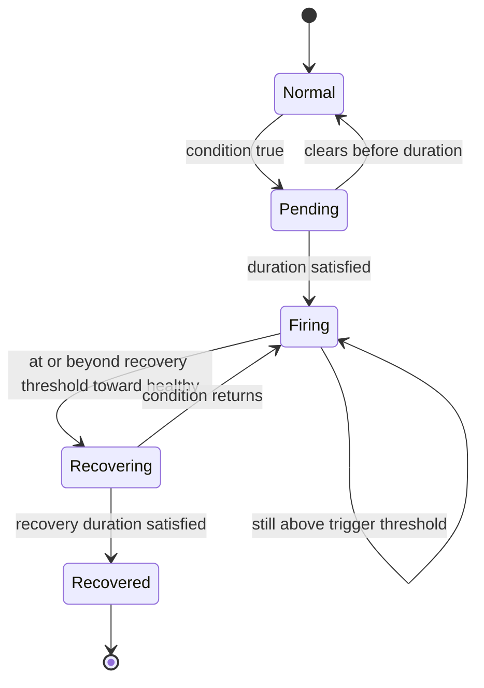

# Monitor 데이터 모델 검토

> 요구사항: Monitor.md 1-4, M0-08~12/17/24
> 기준 커밋: `3c2a0a8ae7d44154d2a5dee960315a72338c3ffc`

## 결론

현재 모델은 relational DB가 아니라 **single-host fixed-schema files**다. telemetry privacy와 bounded cardinality는 강하지만 identity, lifecycle, source availability, alert delivery와 authorization scope를 표현할 entity가 없다. 따라서 현재 schema를 폐기하고 DB를 즉시 새로 만드는 대신 다음 순서를 권장한다.

1. 기존 JSON 응답에 backward-compatible `schemaVersion`, stable identity, source status를 optional하게 추가한다.
2. alert metadata/state와 audit처럼 mutation/관계가 필요한 부분만 embedded SQLite 또는 중앙 metadata store로 분리한다.
3. multi-host가 실제 목표가 된 뒤 telemetry append segments 또는 time-series store를 dual-write/read-compare 방식으로 도입한다.

아래 “개선 모델”은 **제안**이며 현재 구현이 아니다.

## 현재 영속 모델

### 현재 entity와 제약

| DM ID | Entity | 현재 key/state | 저장 위치 | 판정 |
| --- | --- | --- | --- | --- |
| DM-01 | Host | hostname만 사실상 식별자, OS/arch/CPU/uptime | `current.json.host` | 불충분: rename/clone/duplicate 불가 |
| DM-02 | Agent/collector | fixed version string, timer gap | `current.json.system`, reliability event | entity 없음: agentId/config/version lifecycle 불가 |
| DM-03 | Docker daemon | owner label `cks`만 | 없음 | 미구현 |
| DM-04 | Compose project/service | collector private allowlist tuple → public fixed name | code constant + container row `name` | identity가 projection 과정에서 소실 |
| DM-05 | Container instance | private runtime key `owner:containerId`, public fixed name | `/run/.../cpu-state.json`, public snapshot | runtime CPU delta에는 유용, lifecycle/digest에는 불충분 |
| DM-06 | Process | PID/start hash는 private delta, public은 executable class/count | runtime state, incident embed | privacy 우수; 평시 service identity 없음 |
| DM-07 | systemd service | 없음 | 없음 | 미구현 |
| DM-08 | Telemetry sample | timestamp | daily JSONL | duplicate timestamp merge 외 sequence/source ID 없음 |
| DM-09 | Filesystem | mount/device dedup 후 public mount | current snapshot | remount/device change lifecycle 없음 |
| DM-10 | Log/event | full row fields, source별 cursor는 private | event JSONL + `.state` | sourceId/drop status/correlation ID 없음 |
| DM-11 | Alert rule | 7 reason과 thresholds가 code/config fields | Python constants/env | version/history/owner/channel 없음 |
| DM-12 | Alert instance | incident ID (`incident-UTC-second`) | lifecycle state + incident JSONL | second collision 가능, alert group/target/delivery 없음 |
| DM-13 | Notification/delivery | 없음 | 없음 | 미구현 |
| DM-14 | Incident | evidence capture phase active/follow-up/recovered | incidents JSONL | ack/assignee/note/severity/correlation 없음 |
| DM-15 | User | SSO request subject/email/groups or one local password | request/local state | SSO user DB는 외부, team/resource scope 없음 |
| DM-16 | Team/permission scope | role rank와 fixed permissions | `server/sso.ts` | entity scope 없음 |
| DM-17 | Audit | imported privilege row, updater audit row | JSONL | application mutation audit 없음 |
| DM-18 | Infrastructure work ledger | immutable work/revision/reference snapshot | separate root append stream/public snapshot | 운영 backlog 모델이며 monitoring entity를 대체하지 않음 |

## 현재 상태값의 충돌과 모호성

| 영역 | 현재 값 | 문제 | 정규화 방향 |
| --- | --- | --- | --- |
| Data freshness | API `stale: boolean`, nullable metric | unsupported/permission/failed/no-data/stale가 모두 null 또는 empty로 합쳐짐 | source와 metric availability 별도 enum |
| Container | Docker `state`, health `none|unknown` | `none`이 no healthcheck인지 stopped인지 source omission인지 불명확 | lifecycle, runtimeState, healthSupport, collectionStatus 분리 |
| Incident | `active|follow-up|recovered` | alert pending/silenced/suppressed/ack와 섞을 수 없음 | alert evaluation과 incident workflow 분리 |
| Power | flags/powerState와 UI voltage threshold | evidence와 authoritative condition 충돌 | measurement, conditionSource, conditionState 분리 |
| Host lifecycle | uptime/boot only | disabled/maintenance/disconnected/decommissioned 없음 | asset lifecycle enum |
| Error | empty list/null/whole collector failure | 권한 부족과 정상 empty를 구분 못함 | typed source status + last error code |

## 안정적인 식별 정책

### 원칙

- 표시 이름은 key가 아니다.
- private infrastructure identity와 public UI label을 분리한다.
- cardinality 높은 container ID/PID는 bounded metadata/lifecycle store에만 두고 metric label로 직접 사용하지 않는다.
- identity 생성/merge는 server 또는 owner-only agent state에서 idempotent하게 수행한다.

| 대상 | 제안 stable key | 변경/재생성 처리 | 공개 범위 |
| --- | --- | --- | --- |
| Host | owner-only persisted UUID `hostId`; optional machine-id hash는 충돌 보조 evidence만 | hostname/OS change에도 유지, cloned UUID conflict는 registration nonce로 분리 | opaque hostId + displayName |
| Agent | `agentId` UUID + hostId + installation epoch | reinstall은 새 agentId, host relation 유지 | agent version/status only |
| Docker daemon | hostId + daemonId (owner/rootless context fingerprint) | daemon data-root 재생성 시 new epoch | owner class와 availability |
| Compose project | hostId + normalized project key | rename은 explicit alias/migration | project display label |
| Compose service | projectId + canonical service key | container recreate에도 유지 | canonical service name |
| Container instance | daemonId + raw Docker ID, private | recreation은 새 instance, same service relation | opaque bounded instanceId only when needed |
| Image | registry/repository + immutable digest | tag move는 new observation/drift | digest, never registry credential |
| Filesystem | hostId + major:minor/private device identity + mount epoch | remount/mount rename as observation | mount label and capacity only |
| Process instance | hostId + PID + start time, private | PID reuse safely new instance | fixed executable/service class |
| systemd unit | hostId + exact allowlisted unit name | enable/disable is state transition | allowlisted unit label |
| Metric series | hostId + metric key + bounded dimensions | reject unknown/high-cardinality labels | fixed schema/allowlist |

## 개선 entity relationship 제안

### 최소 entity fields

| Entity | 필수 fields | 금지/주의 |
| --- | --- | --- |
| Host | hostId, displayName, lifecycle, registeredAt, lastHeartbeatAt, architecture, timezone display preference | raw machine-id 공개 금지 |
| Agent | agentId, hostId, installEpoch, version, capabilities, lastSequence, state | token plaintext 저장 금지 |
| DataSource | sourceId, hostId, kind, support, status, lastAttempt/Success, errorClass, droppedCount | raw error/credential 금지 |
| MetricSample | hostId, metricKey, observedAt UTC, receivedAt UTC, value, unit, fixed dimensions, sequence | arbitrary label 금지 |
| ContainerInstance | instanceId, daemonId, serviceId, imageDigest, started/finishedAt, restart/OOM/health/security reduced fields | raw env/command/mount path 기본 금지 |
| AlertRule | ruleId, version, target selector, conditions, interval, duration, severity, recovery, noData, labels, description, channel refs, support/permission/runbook | executable expression/arbitrary code 금지 |
| AlertInstance | fingerprint, ruleVersion, target, state, pending/firing/recovered times, groupKey, suppressedBy, evidence refs | mutable evidence overwrite 금지 |
| DeliveryAttempt | idempotencyKey, alertId, channel, attempt, scheduled/started/completed, resultCode, bounded response metadata | webhook secret/response body 금지 |
| Silence | selector, starts/ends, recurrence, createdBy/reason | indefinite silence explicit warning |
| Incident | incidentId, status, severity, opened/closed, ack/assignee, summary | raw log duplication 금지 |
| APIKey | keyId, hash, scopes, resource scope, expiresAt, lastUsedAt, IP policy, revokedAt | original key 저장 금지 |
| AuditEvent | immutable id/time/actor/action/target/result/request correlation | password/token/request body 금지 |

## 상태 전이

### Asset와 source

`Deleted`를 일반 runtime state로 쓰지 않는다. metadata는 decommission tombstone과 audit retention을 보존하고 telemetry는 retention policy로 별도 만료한다.

### Alert evaluation과 incident

Silenced/Suppressed는 evaluation state가 아니라 delivery/presentation modifier다. 평가 기록은 계속 남겨야 한다. Incident `open|acknowledged|resolved|closed`도 alert state와 별도다.

## 시간·단위·cardinality

- `observedAt`, `receivedAt`, state transition times는 timezone-aware UTC ISO 또는 epoch ns/ms 중 하나를 contract별 고정한다. UI만 locale timezone으로 표시한다.
- CPU/percentage는 0~100 host aggregate, container CPU는 multi-core policy를 명시한다. bytes와 bytes/s를 혼용하지 않는다.
- metric dimensions는 schema registry allowlist로 제한한다. PID, container raw ID, request path, user identity를 timeseries label로 쓰지 않는다.
- counter에는 reset epoch와 monotonic/absolute 의미를 저장한다. out-of-order window와 duplicate key를 ingest contract에 명시한다.
- `null`은 값 없음이지 status가 아니다. 값과 availability status를 함께 전달한다.

## 점진적 마이그레이션

| 단계 | 변경 | 호환/rollback | 데이터 이동 | gate |
| --- | --- | --- | --- | --- |
| DM-M1 | response `schemaVersion`, hostId/sourceStatus optional fields | old reader ignores extra fields; new reader defaults legacy unknown | owner-only host identity file 생성 | duplicate/clone/restart tests |
| DM-M2 | container row v2 with compose IDs/reduced security/resources/digest | server accepts v1/v2; exporter rollback leaves v1 | no raw metadata migration | exact-schema privacy contract |
| DM-M3 | versioned default rule files + file-backed durable evaluator state | feature flag and shadow evaluation; old incident path remains read-only | 7 incident thresholds seed로 변환 | old/new transition diff must match known cases |
| DM-M4 | metadata/rules/audit SQLite or central store | expand-only schema, backup before migration, old binary read-compatible | import rule/audit metadata, not raw telemetry | migration/rollback/restore CI |
| DM-M5 | append segment or TSDB dual-write | file source remains authority until read-compare passes | bounded history backfill with checksum | no count/min/max divergence |
| DM-M6 | multi-host ingest and local spool | single-host local mode retained | host identity registration | duplicate/out-of-order/offline replay tests |

각 migration은 별도 revision과 rollback command를 가져야 한다. 현재 저장소에는 DB migration framework가 없으므로 DM-M4 이후를 완료로 보고해서는 안 된다.

## architecture·Ubuntu·Raspberry Pi 영향

| 모델 영역 | amd64/arm64 원칙 | Raspberry Pi 영향 | migration/test gate |
| --- | --- | --- | --- |
| Host identity | architecture나 hostname을 identity key로 쓰지 않고 persisted opaque UUID를 쓴다. | SD image clone으로 UUID까지 복제될 수 있으므로 registration nonce와 conflict 상태가 필요하다. | amd64↔arm64 reinstall, hostname change, cloned image collision test |
| Capability | `architecture`는 inventory이고 `capabilities`/source support와 분리한다. arm64를 Pi로 간주하지 않는다. | hwmon, vcgencmd, EXT5V, throttle 지원과 permission을 source별로 표현한다. | Pi supported/unsupported/permission-denied와 generic arm64 fixture |
| Time/unit | 양 architecture에서 UTC/time unit과 integer bound를 동일 schema로 강제한다. | 전원 차단·RTC/NTP 지연의 `observedAt`/`receivedAt` 차이를 보존한다. | clock skew, reboot, counter reset, out-of-order test |
| Container/cgroup | Docker daemon/service identity는 CPU architecture와 독립이다. cgroup mode는 capability다. | rootless Docker와 constrained memory에서 raw instance state/cardinality를 bounded한다. | amd64/arm64, cgroup v1/v2, container recreate test |
| Storage format | JSON/SQLite/segment encoding은 endian·architecture-neutral version을 사용한다. | SD write amplification 때문에 high-churn lifecycle/evaluation state는 batch/journal하고 size cap을 둔다. | old/new binary read, power-cut replay, Pi write/RSS soak |
| Alert support | rule identity/metadata는 공통이지만 required signal support를 architecture별로 기록한다. | Pi-only rule은 non-Pi에서 `unsupported`이고 generic arm64에서 firing하면 안 된다. | 82-rule support matrix와 cross-platform golden test |

## P0 model 완료 조건

1. Host/agent/source가 stable ID와 explicit lifecycle/status를 가진다.
2. Compose service와 container instance가 분리되고 image digest가 연결된다.
3. unsupported, permission denied, collection failed, no data, stale, fresh가 값과 독립적으로 표현된다.
4. rule/evaluation/alert/delivery/incident/silence/audit가 각각 별도 entity와 state를 가진다.
5. 모든 public fields는 fixed-schema/cardinality/privacy test를 통과한다.
6. legacy current/history files를 읽는 동안 새 writer rollback이 가능하고 migration interruption을 재실행해도 안전하다.
