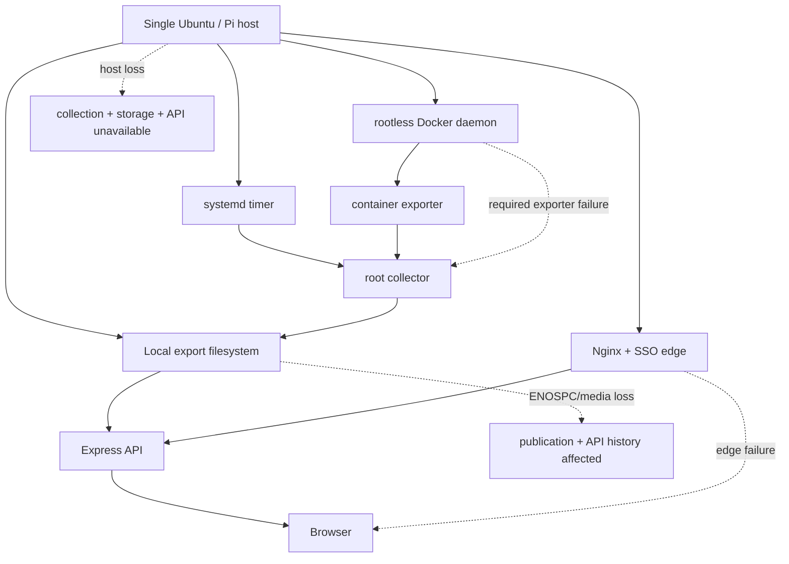

# Monitor 장애 지점과 전파 분석

> 요구사항: Monitor.md 1-3, M0-13~17/20~24
> 기준 커밋: `3c2a0a8ae7d44154d2a5dee960315a72338c3ffc`

## 단일 장애 영역

현재 구성은 수집, durable state, API와 monitored host가 한 물리 host와 한 storage에 있다. 복잡한 distributed failure는 적지만 host·filesystem·rootless Docker·Nginx/SSO 경계가 각각 큰 blast radius를 가진다.

### 높은 위험의 전파 경로

1. `monitor-collector.service`가 `Requires=monitor-container-exporter.service`이고 exporter는 allowlisted project list 하나가 실패해도 exception을 낸다. Docker 장애가 독립적인 procfs host sample publication까지 막을 수 있다.
2. export filesystem ENOSPC/inode failure는 current/history/cursors/pending journal을 함께 막는다. atomic replace는 partial file을 줄이지만 새 data를 보존할 다른 장치가 없다.
3. 동일 host 전원·NVMe 장애는 관측 대상과 Monitor 자체를 동시에 제거한다. 외부 dead man's switch가 없다.
4. API는 request마다 bounded files를 동기 parse하므로 큰 30d 조회나 동시 사용자 증가가 모든 API 요청을 지연시킬 수 있다.

### 시나리오 판정과 증거 인덱스

`부분 통과`는 장애를 일부 안전하게 견디거나 감지하지만 원인 상태·유실·자동 복구·시험 중 하나 이상이 없다는 뜻이다. `실패`는 현재 결합이 장애를 다른 수집 단계로 전파한다는 뜻이다. `해당 경로 없음`은 안전성 구현 완료가 아니라 요구한 subsystem 자체가 없다는 뜻이다.

| FI 범위 | 판정 | 기준 커밋의 실행 증거 |
| --- | --- | --- |
| FI-01~02 | 부분 통과 | local timer/collector-gap과 boot transition은 `ops/systemd/monitor-collector.timer:4-10`, `ops/collector.py:1877-1977`에 있다. remote agent/heartbeat/spool은 없다. |
| FI-03 | 부분 통과 | Pi hwmon/kernel/vcgencmd path는 `ops/collector.py:945-986,1496-1551`; 외부 dead man은 없다. |
| FI-04~05 | 실패 | exporter가 project query 실패 시 raise하고(`ops/collector.py:1668-1677`), collector unit이 exporter를 `Requires`한다(`ops/systemd/monitor-collector.service:4-12`). |
| FI-06 | 부분 통과 | local file collection은 Express와 분리되지만 read API는 sync file parse다(`server/data.ts:1478-1547`). remote ingest API는 없다. |
| FI-07~08 | 해당 경로 없음 | telemetry queue/DB dependency·migration이 없다. updater의 별도 depth-8 queue는 telemetry 안전성 증거가 아니다. |
| FI-09~11 | 부분 통과 | atomic replace/journal과 kernel storage event는 있으나 ENOSPC/inode/media 복구 경로가 없다(`ops/collector.py:319-555,1877-1977,3435-4201`). |
| FI-12~13 | 부분 통과 | local collection은 network-independent이나 browser/SSO/update/deploy에 retry/spool이 없고 remote agent path가 없다. |
| FI-14~15 | 미구현 | TLS synthetic probe와 notification channel/outbox/worker가 없다. |
| FI-16 | 부분 통과 | byte/line/response cap은 있으나 `readDashboard()`가 request마다 sync read/parse한다(`server/data.ts:17-25,1478-1547`). |
| FI-17 | 검증 불가 | workflow는 external `deploy monitor SHA`만 호출한다(`.github/workflows/deploy.yml:90-123`); dispatcher/rollback 구현은 저장소 밖이다. |
| FI-18 | 해당 경로 없음 | DB와 migration framework가 없다. 향후 도입 안전성이 입증된 것은 아니다. |
| FI-19~21 | 부분 통과 | +60초 future reject, bounded log windows, fixed labels와 Docker 200 cap은 있으나 skew/drop/completeness 상태가 없다(`server/data.ts:1492-1504`; `ops/collector.py:109-140,1665-1707`). |
| FI-22 | 미구현 | collector/agent signed rollout, version negotiation, rollback manager가 없다. host package updater는 별도 기능이다. |

## 명세 장애 시나리오

| FI ID | 장애 상황 | 현재 동작 | 데이터 유실·복구 가능성 | 개선·우선순위 | 재현/시험과 완료 조건 |
| --- | --- | --- | --- | --- | --- |
| FI-01 | 에이전트 종료 | 독립 agent는 없고 systemd collector one-shot 실패/중단이 해당한다. last snapshot은 남고 5분 후 API stale | 중단 interval은 영구 유실, restart 후 next sample부터 복구 | heartbeat/source status 및 bounded spool, P0 | 가상 timer로 6 interval skip 후 restart. 원인별 stale와 gap count가 보이고 허용 buffer 내 sample이 replay되면 완료 |
| FI-02 | Linux host 재부팅 | host-boot/restarted와 historical collector gap을 기록; runtime delta가 사라져 첫 rate는 null | persistent export/state는 남음. reboot 동안 data 없음; 자동 backfill 없음 | expected reboot/clock boot ID와 external heartbeat, P0 | fixture uptime/boot change와 actual VM reboot test. boot event가 한 번만 생기고 stale·recovery가 분리되면 완료 |
| FI-03 | Pi 전원 차단/저전압 | hwmon/kernel signal이 살아 있을 때 semantic event; 완전 전원 차단은 내부 관측 불가 | abrupt power loss 전 마지막 fsync까지만 보존. 같은 SD/NVMe면 Monitor도 사라짐 | external dead man, durable storage, voltage-only false-positive 제거, P0 | power-cut simulation + Pi hardware test. 외부가 heartbeat miss를 알리고 복구 후 duplicate event가 없으면 완료 |
| FI-04 | Docker daemon 장애 | exporter list가 실패하고 previous reduced snapshot은 교체하지 않음. required collector가 실패할 수 있음 | host sample까지 한 interval 이상 유실 가능; daemon 복구 후 다음 run | host/Docker stage 격리와 explicit daemon status, P0 | fake socket timeout/500. host metrics는 계속 fresh이고 Docker만 failed/stale이면 완료 |
| FI-05 | Docker socket 권한 상실 | socket/helper failure로 exporter non-zero; stderr에는 error type만 기록 | FI-04와 동일. permission-denied와 daemon-down 구분 불가 | source error taxonomy, owner/mode preflight, P0 | fixture socket mode/owner 변경. UI/API가 permission_denied로 분류하면 완료 |
| FI-06 | 수집 API 장애 | remote ingest API가 없다. dashboard read API 장애 시 collection/files는 계속됨 | telemetry 수집은 유지하지만 사용자는 조회 불가; Express restart 후 file read 복구 | 명시적 ingest/read 분리와 API SLI, P1 | Express kill/latency injection. collector 지속, recovery 후 gap 없는 조회와 API alert가 확인되면 완료 |
| FI-07 | 메시지 큐 장애 | telemetry queue는 없음. updater private directory queue만 있고 depth 8 | telemetry 해당 없음. update queue full은 409, claimed request는 durable recovery | alert/notification outbox를 별도 도입하고 queue metrics, P0 | queue full/corrupt inode/crash replay. 평가가 막히지 않고 failed delivery가 남으면 완료 |
| FI-08 | 데이터베이스 장애 | 운영 DB가 없다. local JSON/JSONL filesystem 장애가 등가 | backup replica가 없어 media loss 시 telemetry/ledger 손실 | manifest/checksum/backup restore harness; DB 도입은 multi-host P1 | clean-host restore drill. 선언한 RPO/RTO와 checksums 만족 시 완료 |
| FI-09 | 디스크 부족 | atomic write/rename/fsync에서 collector 실패. updater는 apply 전 free-space check | old target은 보존될 수 있으나 새 sample/event/cursor는 기록 불가. drop 상태 자체 기록도 어려움 | reserved status path, read-only degradation, external disk alert, P0 | loopback/fixture ENOSPC. process 생존, old data readable, external alert와 recovery readback이면 완료 |
| FI-10 | inode 부족 | 새 temp/pending/current creation 실패; 전용 처리 없음 | FI-09와 동일, byte free가 있어도 실패 원인 구분 안 됨 | inode preflight/self metric/compaction, P0 | inode-exhausted filesystem. inode reason과 safe degradation 입증 시 완료 |
| FI-11 | SD/NVMe 오류 | kernel filesystem/NVMe/AER semantic event를 읽을 수 있으면 기록 | 동일 장치의 write/read failure나 host crash 시 event도 유실. remote copy 없음 | 외부 health path, backup, read-only failover; SMART/RAID signal, P0/P1 | I/O error/read-only mount fixture + hardware SMART. local write 실패 전 외부 event 또는 dead man이 발생하면 완료 |
| FI-12 | 네트워크 단절 | local collector는 계속. browser/SSO 접근과 APT/GitHub deploy는 실패 | host telemetry 유지. browser refresh 실패; update/deploy는 operator 재시도. remote buffer 없음 | API fetch timeout, alert outbox retry/backoff/jitter, agent spool, P0 | network/DNS fake와 reconnect storm. bounded memory·duplicate-free replay·visible status면 완료 |
| FI-13 | DNS 장애 | collector core는 DNS 미사용. SSO/public access/APT/GHCR이 영향 | telemetry 유지, access/update/deploy 불가 | external probe, explicit dependency state와 bounded retries, P1 | resolver failure. core collection 지속 및 dependency-specific alert면 완료 |
| FI-14 | 인증서 만료 | TLS는 external Nginx 책임이며 Monitor는 certificate를 수집하지 않음 | public dashboard 접근 중단; 내부 loopback API는 살아 있음 | synthetic TLS expiry rule with SSRF-safe target policy, P0 | near-expiry/invalid chain fixture. advance warning과 invalid alert가 외부 전달되면 완료 |
| FI-15 | 알림 채널 장애 | channel/outbox 자체 미구현 | 모든 자동 notification이 존재하지 않아 운영자가 polling하지 않으면 사건 인지 불가 | delivery outbox/retry/jitter/idempotency/final-failure, P0 | webhook 500/timeout/rate limit. evaluator 비차단, retry schedule와 terminal log가 정확하면 완료 |
| FI-16 | 대시보드 API 지연 | sync file parse 동안 Node event loop 점유; request timeout/cache 없음 | collection은 유지, 모든 동시 사용자 응답 지연·container health 영향 가능 | parsed snapshot cache/index, request budget, load gate, P0 | maximum safe files + concurrent clients. p95/RSS가 budget 내이고 health가 responsive하면 완료 |
| FI-17 | 잘못된 배포 | CI는 image test 후 external `deploy monitor SHA` 요청. README는 readiness 실패 rollback을 설명 | 실제 dispatcher/rollback code가 외부여서 현재 감사로 복구 입증 불가 | canary/readback/rollback artifact와 immutable previous digest, P0 | known-bad image in staging. readiness 실패 후 exact previous digest와 revision이 복구되면 완료 |
| FI-18 | DB migration 실패 | DB/migration framework 없음 | 현재 해당 없음. 향후 DB 도입 시 guard가 전혀 없음 | expand/migrate/contract와 rollback/compat matrix, P1 prerequisite | forward/backward migration on production-like copy, interruption/retry. old/new server 동시 read 성공 시 완료 |
| FI-19 | host 시간 불일치 | host time으로 UTC timestamp 생성, API는 +60s future만 제외 | skewed sample drop, graph gap/ordering 왜곡; 원인·보정 없음 | server received time, skew measurement/policy, P0 | ±1m/±1h, correction 후 replay. skew status와 duplicate/out-of-order policy가 일관되면 완료 |
| FI-20 | 로그 폭증 | per-run newest bounded bytes/line만 처리, output record cap; traffic logrotate | cursor가 backlog old portion을 건너뛸 수 있고 drop count 없음. 전체 collector CPU/memory 사용 증가 | source quota/sampling/priority/drop counter and isolation, P0 | >bounds input and continuous append. high-priority event 유지, exact dropped count, telemetry 지속 시 완료 |
| FI-21 | 메트릭 폭증 | sample schema/labels fixed, history 1 row/run. Docker list >200은 whole exporter failure | cardinality 폭증은 억제되나 workload 초과는 Docker/collector stale로 전파 | graceful truncation with completeness/drop count, target-scale test, P0 | 201 allowed rows and 30+ stats. host fresh, Docker incomplete explicit, bounded resource면 완료 |
| FI-22 | agent update 실패 | 별도 agent updater/version rollout 없음. host APT update broker는 Monitor agent compatibility를 관리하지 않음 | failed package update가 collector binary/unit에 영향을 줄 수 있으나 version skew policy 없음 | signed agent package, staged rollout/rollback/version compatibility, P1/P2 | old/new collector-server contract matrix + failed install rollback. previous agent resumes heartbeat면 완료 |

## 추가 운영 장애

| FI ID | 장애 | 현재 안전장치 | 남은 위험/완료 조건 |
| --- | --- | --- | --- |
| FI-23 | collector crash 중 multi-file commit | pending incident/log/reliability journal과 digest replay | `current.json`/history publication과 incident commit 사이 snapshot consistency marker가 없다. 동일 capture ID로 all outputs correlation 필요 |
| FI-24 | malformed/unsafe pending journal | fail closed, journal 보존 | operator runbook과 automatic external alert가 없다 |
| FI-25 | update worker crash | claimed request를 interrupted/terminal audit로 복구하고 APT 재실행 안 함 | package manager가 validator 시작 후 hang한 경우 manual recovery 필요; runbook rehearsal 필요 |
| FI-26 | central SSO/edge secret mismatch | app fail closed | health는 public loopback only; external authenticated journey probe가 필요 |
| FI-27 | log source rotation race | inode residual tail + durable Nginx reopen marker | third-party rotation naming/retention가 contract 밖이면 tail 손실; source support state 필요 |

## architecture와 Pi 영향

| 영역 | amd64 | arm64 | Raspberry Pi 5 |
| --- | --- | --- | --- |
| procfs/statvfs | 예상 호환, CI 없음 | image build 내 parser tests | 실제 host live test 없음 |
| hwmon/vcgencmd | 일반적으로 unsupported여야 함 | command 존재 여부에 따라 null | `rpi_volt`, EXT5V path가 hardware/firmware에 따라 다름 |
| Docker stats | daemon API 기반으로 예상 호환 | ARM runner image build만 검증 | rootless daemon와 memory/SD budget이 중요 |
| systemd sandbox | Ubuntu release별 directive 차이 가능 | 동일 | `/dev/vcio` device policy 필요 |
| failure injection | 없음 | 없음 | power-cut/low-memory/storage wear 실제 시험 필수 |

## P0 장애 격리 작업

1. Docker exporter 실패가 host sample publication을 취소하지 않도록 source별 independent result를 만든다.
2. 모든 source에 `status`, `lastSuccessAt`, `errorClass`, `droppedCount`를 추가한다.
3. alert evaluator와 notification outbox를 collector와 분리하고 bounded queue를 둔다.
4. external dead man's switch로 host+Monitor 동시 장애를 감지한다.
5. ENOSPC/inode/log storm/clock skew/network fault harness를 작성하고 amd64/arm64에서 실행한다.
6. production-like staging에서 bad deploy rollback과 clean-host restore를 실제로 반복한다.

이 항목들은 [로드맵](monitoring-roadmap.md)의 RM-P0-02, 04, 05, 06, 09, 10과 연결된다.
