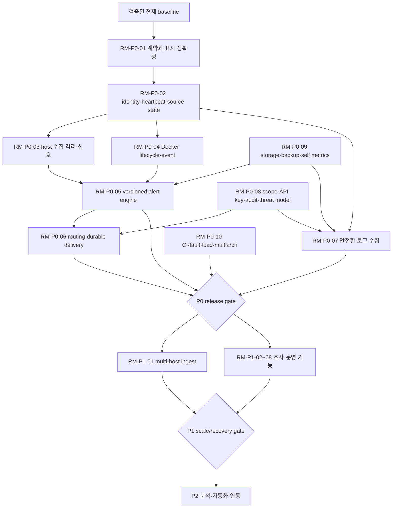

# Monitor 신뢰성 우선 구현 로드맵

> 요구사항: Monitor.md 1-6, 19장, 20장, 최종 감사 FA-01~50
> 기준 커밋: `3c2a0a8ae7d44154d2a5dee960315a72338c3ffc`
> 기준일: 2026-08-30

## 문서의 상태

이 문서는 **제안된 작업 순서**이며 구현 결과가 아니다. 각 `RM-*` 항목의 초기 상태는 모두 `계획/미완료`다. 코드, migration, 운영 readback, 요구한 test gate가 실제로 합쳐지기 전에는 완료로 바꾸지 않는다. 현재 판정과 근거는 [50항목 최종 감사](monitoring-final-audit.md), [갭 분석](monitoring-gap-analysis.md), [장애 분석](monitoring-failure-analysis.md)에 고정되어 있다.

이미 입증된 자산은 다음과 같다.

- proc/sys/statvfs 기반 bounded host sample과 60초 systemd timer
- Docker socket을 root collector에서 격리한 `cks` rootless reduced exporter
- atomic file write, bounded JSON/JSONL, pending journal replay와 fixed-cardinality/privacy contract
- SSO edge-secret 검증, local signed session, updater의 allowlist/rollback 방어
- bounded API normalization/downsampling과 현재 dashboard
- 기준 시점 Vitest 22 files/186 tests, Python 142 tests, client/server TypeScript 검사 통과

이 자산을 보존하면서 missing identity, explicit source state, alert delivery, logs, restore proof와 cross-architecture release gate를 추가한다. 새 DB나 중앙 agent를 먼저 도입해 현재의 단일-host 신뢰성을 잃지 않는다.

## 우선순위와 승격 원칙

| 우선순위 | 의미 | 완료 승격 조건 |
| --- | --- | --- |
| P0 | 잘못된 정상/위험 표시, 데이터 유실, 무알림, 권한 경계, 복구·배포 증거처럼 운영 안전성을 좌우한다. | collector→storage→API→UI 또는 evaluator→outbox→delivery 전체 경로, failure test, docs/runbook, amd64+arm64 gate가 모두 있다. |
| P1 | 대응 속도·조사력·다중 대상 운용을 크게 높이지만 P0 경계 위에 구축해야 한다. | scope/retention/backpressure/rollback을 포함한 production path와 integration/E2E가 있다. |
| P2 | 장기 분석·자동화·고급 연동이다. 핵심 경로가 없어도 Monitor가 안전하게 동작해야 한다. | opt-in/disable path, 비용·privacy budget, fallback이 입증된다. |

“UI에 보임”, “type이 있음”, “test 이름이 있음”, “roadmap에 있음”은 완료 증거가 아니다. 기본 규칙도 signal이 없으면 `unsupported`로 표시해야 하며 firing 가능 규칙으로 세지 않는다.

## 의존 관계와 stage gate

- **Gate A — truth:** unknown/no-data/stale/failure가 값과 분리되고 현재 오표시가 제거된다.
- **Gate B — signal:** host·Docker source failure가 격리되고 필요한 signal과 support status가 안정적이다.
- **Gate C — action:** rule state, inhibition/silence, outbox/delivery가 crash-safe하고 auditable하다.
- **Gate D — release:** backup restore, rollback readback, amd64/arm64, fault/load/security gate가 통과한다.
- **Gate E — scale:** 그 뒤에만 multi-host와 범용 logs를 목표 규모로 확장한다.

## P0 — 운영 안전성

### RM-P0-01 — 상태 계약과 표시 정확성

- **요구/현재 상태/근거:** FA-03/09/23~25, Monitor.md 0-17/24, 8-2~4, 9-10. 전역 `stale`과 nullable metric만 있고, `src/operational-health.ts:543-599`는 voltage-only threshold를 경고로 만든다. CPU 기본은 한 sample이다(`README.md:511-513`). **부분 통과/실패 → 계획**.
- **사용자·장애 대응 가치:** 0, unknown, unsupported, permission denied, collection failed, stale를 즉시 구분하고 false critical/false recovery를 막는다.
- **난이도/선행 작업:** 중간. 다른 P0의 schema foundation이라 선행 없음.
- **영향 모듈/마이그레이션:** `ops/collector.py`, `server/types.ts`, `server/data.ts`, `src/operational-health.ts`, dashboard components, README. 기존 response에 optional `schemaVersion`, per-source status를 expand-only로 추가하고 legacy reader default는 `unknown`; DB migration은 없다.
- **구현 slice:** canonical availability enum과 unit/time contract, stale age/last-success/error-class를 추가한다. Pi warning은 hwmon/kernel throttle evidence만 authoritative하게 하고 voltage는 evidence로 유지한다. 최소 duration/recovery semantics 없이는 finding을 alert로 부르지 않는다.
- **위험/보안/호환성:** raw error/path를 public status에 넣지 않는다. amd64에는 Pi field가 `unsupported`, arm64라고 무조건 Pi로 가정하지 않는다. Pi에서 추가 probe는 bounded/optional이어야 한다.
- **재현:** flags=0, voltage=4.70 fixture; metric `null`; collector 중단 6분; permission-denied fixture를 각각 API/UI에 넣어 현재 서로 합쳐지거나 voltage warning이 생기는지 확인한다.
- **시험:** exact-schema contract, virtual clock stale boundary, unit/UTC, legacy response, voltage-only non-alert, supported/unsupported/denied/failed E2E.
- **완료 조건:** API와 UI가 여섯 availability state를 일관되게 표시하고, 단일 고값/전압-only로 firing하지 않으며, old data/API가 안전하게 `unknown`으로 읽힌다.

### RM-P0-02 — stable host/agent identity와 heartbeat

- **요구/현재 상태/근거:** FA-01~03/41, Monitor.md 2-1/2-5, 11-3~6/9. snapshot에는 hostname뿐이고 agent/ingest/spool이 없다(`ops/collector.py:4846-4853`). **미구현 → 계획**.
- **사용자·장애 대응 가치:** hostname 변경·clone을 혼동하지 않고 HostDown, AgentHeartbeatMissing, AgentDataStale의 원인을 구분한다.
- **난이도/선행 작업:** 중간. RM-P0-01 schema contract 선행.
- **영향 모듈/마이그레이션:** owner-only collector state, collector schema, API/types/UI. persisted UUID와 installation epoch를 생성하되 raw machine-id는 공개하지 않는다. 최초 rollout은 legacy host를 하나의 generated ID에 idempotent하게 attach하고 backup/rollback file을 보존한다.
- **구현 slice:** `hostId`, `agentId`, boot/install epoch, monotonic sequence, observed/received time, source heartbeat와 lifecycle을 추가한다. 중앙 ingest는 P1이며 P0에서는 single-host identity와 heartbeat semantics를 먼저 완성한다.
- **위험/보안/호환성:** UUID clone collision, symlink/state-file tamper, identity reset으로 경보 우회 위험. mode/nofollow/atomic write를 유지한다. architecture-independent format을 쓴다; Pi SD write는 identity 변경 시에만 발생해야 한다.
- **재현:** hostname 변경, state directory copy, reboot, timer stop/restart, last sample 일부 누락을 fixture로 실행한다.
- **시험:** duplicate UUID/clone nonce, restart/reinstall, counter reset, out-of-order timestamp, stale threshold와 HostDown inhibition virtual-clock test.
- **완료 조건:** rename은 같은 host, clone은 다른 host, reinstall은 same host/new agent로 표현되고 heartbeat/source gap의 원인이 UI/API/rule evidence에 남는다.

### RM-P0-03 — collector 장애 격리와 필수 Linux 신호

- **요구/현재 상태/근거:** FA-04~09/42, default rules 1~34. CPU/memory/swap/PSI와 일부 disk/network/kernel/Pi는 있지만 latency/TCP/FD/PID/systemd/clock/support 상태가 없다. collector는 Docker exporter를 `Requires`한다. **부분 통과 → 계획**.
- **사용자·장애 대응 가치:** Docker나 privileged probe 하나가 실패해도 host health를 계속 보고, 실제 Ubuntu 장애를 원인별로 조기에 찾는다.
- **난이도/선행 작업:** 높음. RM-P0-01/02.
- **영향 모듈/마이그레이션:** `ops/collector.py`, systemd units/defaults, schema/server/UI, fixtures. optional fields의 expand-only file schema; historical backfill은 하지 않는다.
- **구현 slice:** source별 deadline/circuit 상태로 host/container/log probe를 격리한다. procfs/sysfs 기반 disk latency/error, TCP/retransmit, FD/PID/zombie, allowlisted systemd, reboot/clock evidence를 fixed schema로 추가한다. SMART/RAID privileged probes는 strict helper가 없으면 `unsupported`로 남긴다.
- **위험/보안/호환성:** `/proc` PID/command와 device path를 공개하지 않고 aggregate/fixed label만 쓴다. systemd/SMART command injection과 privilege widening을 금지한다. kernel/cgroup v1/v2 차이를 capability probe로 처리한다. Pi hwmon/sysfs read와 vcgencmd timeout을 bounded한다.
- **재현:** Docker exporter 실패, missing proc/sys files, permission denied, counter reset, read-only filesystem, OOM/kernel fixture, systemd failed fixture를 한 source씩 주입한다.
- **시험:** source isolation, proc/sys parser property test, Ubuntu amd64/arm64+cgroup v1/v2, Pi supported/unsupported, 60초 deadline/RSS/write budget, privacy exact-schema.
- **완료 조건:** default host rules 1~34 각각 required signal/support/permission/no-data metadata를 가지며, supported P0 rule은 duration/hysteresis로 실제 평가되고 source 하나 실패해도 host sample이 기록된다.

### RM-P0-04 — Docker lifecycle, event와 자원·보안 signal

- **요구/현재 상태/근거:** FA-10~19, Monitor.md 4-1~13, rules 35~53. 현재 public row는 name/owner/state/health/CPU/memory뿐이다(`ops/collector.py:1621-1657`). event/inspect/image/volume/security signal이 없다. **부분 통과/미구현 → 계획**.
- **사용자·장애 대응 가치:** restart loop, OOMKilled, unhealthy, no-limit, throttle, daemon disconnect와 high-risk configuration을 원인과 lifecycle에 맞춰 탐지한다.
- **난이도/선행 작업:** 높음. RM-P0-01/02와 fixed privacy contract.
- **영향 모듈/마이그레이션:** exporter private state, `ops/collector.py`, server schema/API/UI. v2 container row를 optional로 추가하고 server는 v1/v2를 함께 읽는다. raw Docker IDs는 private lifecycle store에만 두고 public stable service/opaque instance ID로 변환한다.
- **구현 slice:** bounded inspect/events/stats adapter, daemon/event cursor, restart/OOM/health/resource limit/throttle/network I/O/image digest/security booleans, Compose project/service relation을 추가한다. list/stats deadline과 last-good age를 분리한다.
- **위험/보안/호환성:** socket은 계속 rootless owner helper에만 bind한다. env/command/raw mounts/registry credential/container ID를 export하지 않는다. Docker API/cgroup 버전 차이는 typed support로 둔다. Pi에서 events/stats burst CPU를 cap한다.
- **재현:** restart/OOM/unhealthy/no-healthcheck/no-limit/privileged/socket-mount/tag/digest fixture, daemon restart, socket permission loss, 30/31/200/201 container를 실행한다.
- **시험:** event cursor replay/dedup, recreate identity, inspect redaction, deadline/backpressure, rootless socket boundary, amd64/arm64 Docker+cgroup v1/v2 integration.
- **완료 조건:** rules 35~53에 필요한 signal이나 explicit unsupported가 있고, daemon/source failure가 host collection을 멈추지 않으며 raw Docker metadata가 public file/API에 없다.

### RM-P0-05 — versioned alert engine과 기본 rule pack

- **요구/현재 상태/근거:** FA-23~28, Monitor.md 8-1~11, 15-8, 18장 rules 1~82. 현재 `incident_transition()`의 7 code reason뿐이고 rule/history/silence/group/inhibition이 없다. **미구현/부분 통과 → 계획**.
- **사용자·장애 대응 가치:** 일시 spike와 상위 장애 폭주를 줄이고 “왜 firing인지, 어떤 데이터가 없었는지” 재현 가능하게 한다.
- **난이도/선행 작업:** 매우 높음. RM-P0-01~04, RM-P0-09 durable state.
- **영향 모듈/마이그레이션:** versioned `ops/rules/`, evaluator/runtime, rule API/types, UI, audit. 기존 7 threshold를 seed로 import하고 shadow evaluate/read-compare 후 old incident writer를 단계적으로 read-only로 전환한다. rule/state schema migration은 idempotent/rollback 가능해야 한다.
- **구현 slice:** validated declarative rule, evaluation interval/duration/recovery/no-data, pending/firing/recover, version history, fixed selectors, group/dedup fingerprint, topology inhibition, silence/maintenance, routing labels를 구현한다. 82개 seed 모두 support/permission/runbook을 가지되 signal 없는 rule은 disabled/unsupported로 명시한다.
- **위험/보안/호환성:** arbitrary code/expression, ReDoS, selector cardinality, unauthorized rule change를 막는다. evaluation state는 bounded한다. integer/float/time semantics는 architecture independent하고 Pi evaluation CPU budget을 계측한다.
- **재현:** 한 CPU high sample, pending 중 missing evaluation, boundary flap, host down+all containers down, maintenance window를 virtual clock으로 재생한다.
- **시험:** table-driven 82-rule metadata contract, duration/hysteresis/no-data, counter reset, dedup/group, parent inhibition/re-evaluation, silence expiry/recurrence, crash between state transitions, shadow diff.
- **완료 조건:** default pack은 versioned data이며 모든 rule의 support가 정직하다. supported rule은 단일 sample로 firing하지 않고 restart-safe state/evidence를 가지며, host recovery 후 실제 하위 장애가 재평가된다.

### RM-P0-06 — routing, durable outbox와 외부 dead man

- **요구/현재 상태/근거:** FA-29/49/50, Monitor.md 8-11~13/16, 14-1. notification entity/channel/outbox가 없고 외부 heartbeat도 없다. **미구현 → 계획**.
- **사용자·장애 대응 가치:** Monitor 화면을 보고 있지 않아도 critical을 받고, 채널 장애가 평가기를 막거나 알림을 영구 유실하지 않는다.
- **난이도/선행 작업:** 높음. RM-P0-05, RM-P0-08 secret/scope, RM-P0-09 durable store.
- **영향 모듈/마이그레이션:** delivery worker/outbox, channel adapters, config/secret provider, API/UI/audit. 기존 delivery data는 없으므로 expand-only schema; rollback 시 queued rows를 보존하고 old binary가 무시하게 한다.
- **구현 slice:** severity/team/environment routing, idempotency key, bounded durable outbox, per-attempt timeout, exponential backoff+jitter, retry/dead-letter/readback, test notification을 구현한다. email/webhook부터 시작하고 channel plugin contract를 분리한다. 독립 외부 endpoint로 privacy-minimal heartbeat를 전송한다.
- **위험/보안/호환성:** webhook SSRF, secret leak, response-body logging, retry amplification을 막는다. destination allowlist/private-IP revalidation과 encrypted/permissioned secret storage를 사용한다. Pi에서 delivery process와 queue를 resource-limit한다.
- **재현:** channel 500/timeout/DNS failure/slow response, worker crash after send-before-ack, duplicate enqueue, queue full, Monitor+proxy outage를 주입한다.
- **시험:** idempotency/crash replay, backoff+jitter virtual clock, secret redaction, SSRF redirect/DNS rebinding, queue overflow, external missed-heartbeat and recovery.
- **완료 조건:** 전송 실패가 evaluator를 막지 않고 모든 시도/최종 실패가 조회·감사되며, Monitor 경계 밖에서 heartbeat 부재 경보가 실제 수신된다.

### RM-P0-07 — 안전한 통합 로그 수집 기반

- **요구/현재 상태/근거:** FA-20~22, Monitor.md 7-1/2/6/7. selected semantic file reader는 있으나 Docker stdout/journald/generic file, multiline, drop accounting이 없다. **부분 통과/미구현 → 계획**.
- **사용자·장애 대응 가치:** metric만으로 설명되지 않는 stack trace/OOM/service failure를 잃지 않고, 폭증이 전체 Monitor를 중단시키지 않는다.
- **난이도/선행 작업:** 높음. RM-P0-01/02 source status, RM-P0-08 scope/masking, RM-P0-09 storage.
- **영향 모듈/마이그레이션:** collector source adapters/cursors, redaction/parser, bounded log segment store, API metadata. 기존 semantic JSONL은 유지하며 새 envelope로 dual-read; raw legacy data를 새 store로 자동 복제하지 않는다.
- **구현 slice:** Docker stdout/stderr, journald, allowlisted files를 source identity로 수집한다. JSON/logfmt/syslog/plain/multiline parser, max lines/bytes, pre-storage redaction version, quota/sampling/priority/drop count를 둔다. search/tail은 P1이다.
- **위험/보안/호환성:** token/JWT/cookie/password/PII가 저장 전에 제거되어야 한다. symlink/path traversal, journal permission, terminal/log injection을 막는다. journald 가용성 차이와 Pi SD write budget을 capability/retention으로 제어한다.
- **재현:** rotation/inode change/container recreate, partial last line, 128 KiB line, 100k-line burst, multiline without terminator, embedded secrets를 fixture로 넣는다.
- **시험:** duplicate/loss cursor contract, masking golden/property tests, oversize/storm/backpressure/ENOSPC, one-source isolation, amd64/arm64 journald/Docker fixture.
- **완료 조건:** supported source의 accepted/dropped/duplicate/status가 계측되고 secret 원문이 disk/API에 없으며 log storm 중 host telemetry와 alert evaluation이 계속된다.

### RM-P0-08 — entity scope, API key, application audit와 threat model

- **요구/현재 상태/근거:** FA-31~34, Monitor.md 13-2~10. role rank/SSO/local secret 보호는 있으나 team/resource scope, API key, application mutation audit, SSRF policy/threat model이 없다. **부분 통과/미구현 → 계획**.
- **사용자·장애 대응 가치:** 팀별 host/log/rule 접근을 분리하고 자동화를 장기 비밀번호와 분리하며 누가 운영 상태를 바꿨는지 확인한다.
- **난이도/선행 작업:** 높음. RM-P0-02 stable resources; mutation API보다 먼저 적용.
- **영향 모듈/마이그레이션:** `server/sso.ts`, auth middleware, scoped entities, API key/audit store, routes/UI/docs. 기존 role을 default global scope로 명시적으로 migrate한 뒤 최소권한 scope를 assign한다. API key는 신규 hash-only record다.
- **구현 slice:** backend-enforced team/environment/host scope, permission matrix, scoped expiring/revocable API keys, immutable audit event, secret provider, CSRF/CSP/error/log review와 persisted threat model을 추가한다.
- **위험/보안/호환성:** horizontal/vertical escalation, forged edge headers, key enumeration, audit tamper, XSS/log injection, SSRF를 분석한다. crypto/dependency는 두 architecture에서 동일 policy를 쓰고 Pi에서 expensive KDF rate limit을 둔다.
- **재현:** 두 팀 user로 같은 host/log endpoint 접근, forged SSO headers, expired/revoked key, rule/silence mutation 후 audit absence를 확인한다.
- **시험:** deny-by-default authorization matrix, object-level scope, key issue/use/revoke/rotation, CSRF/session epoch, audit append/tamper, security headers and SSRF corpus.
- **완료 조건:** 모든 endpoint가 permission+resource scope를 backend에서 강제하고, secret/key 원문은 발급 시 외에는 저장·로그되지 않으며 모든 민감 mutation이 immutable audit에 남는다.

### RM-P0-09 — storage safety, restore, backpressure와 self metrics

- **요구/현재 상태/근거:** FA-35~42/49, Monitor.md 12-1~7/9/10. atomic journal/retention은 강하지만 full backup/restore, ENOSPC degradation, query budget, queue/drop/self metrics가 없다. **부분 통과/미구현 → 계획**.
- **사용자·장애 대응 가치:** 파일 손상·disk full·process crash 뒤 데이터와 alert state를 복구하고 Monitor가 자기 실패를 먼저 드러낸다.
- **난이도/선행 작업:** 높음. 현재 file contracts 이해; RM-P0-01 status.
- **영향 모듈/마이그레이션:** collector file store, server reader/cache, metadata/outbox storage, backup tool/runbook. manifest/checksum과 backup format은 versioned; DB 도입 시 expand-only migration+pre-migration backup+old-reader window가 필수다.
- **구현 slice:** export manifest/checksum, clean-host backup/restore harness, write reservation/ENOSPC typed failure, query byte/time/concurrency budget, bounded queues/drop accounting, collector/API/storage/evaluator/outbox latency/RSS metrics를 추가한다.
- **위험/보안/호환성:** backup에 secret/private state를 섞지 않고 mode/owner/encryption/retention을 분리한다. archive traversal과 restore overwrite를 방지한다. ext4/SD/NVMe fsync 차이를 시험하고 Pi write amplification을 제한한다.
- **재현:** 각 fsync boundary crash, truncated/oversize JSONL, ENOSPC/inode/FD/PID/RSS exhaustion, 30×8 MiB history, export directory loss를 fixture에서 실행한다.
- **시험:** fault injection, checksum/tamper, backup→empty root restore→API/evaluator readback, concurrent 30d requests, recovery RPO/RTO and Pi soak.
- **완료 조건:** versioned RPO/RTO를 실제 clean-host restore가 만족하고, overflow/loss가 계측되며, restart replay가 idempotent하고 API가 memory/time budget을 넘지 않는다.

### RM-P0-10 — CI quality, fault/load, multiarch와 배포 증거

- **요구/현재 상태/근거:** FA-43~48, Monitor.md 11-1, 15-1/3~10. CI는 arm64 build와 tests/Compose config만 있고 amd64, lint/SCA/image scan/SBOM, load/fault/E2E/axe가 없다. dispatcher/production rollback은 repo 밖이다. **부분 통과/미구현 → 계획**.
- **사용자·장애 대응 가치:** 운영이 처음으로 architecture, resource, migration, rollback 문제를 발견하는 상황을 막는다.
- **난이도/선행 작업:** 높음. 각 P0 slice가 제공할 test entrypoint와 SLO.
- **영향 모듈/마이그레이션:** `.github/workflows/deploy.yml`, Dockerfile/Compose, test harness/scripts/docs. DB/data migration 자체보다 migration/rollback gate를 추가한다.
- **구현 slice:** lint/type/unit/integration/E2E/axe, amd64+arm64 image, cgroup v1/v2, dependency/SCA/secret/image scan, SBOM/provenance, target+2× load, deterministic network/disk/clock faults, canary readiness와 immutable rollback readback을 stage별로 추가한다.
- **위험/보안/호환성:** untrusted fork secret exposure, mutable action/image tag, artifact credential leak, QEMU-only false confidence를 막는다. 양 architecture native run 또는 명시적 제한을 기록하고 실제 Pi scheduled soak을 둔다.
- **재현:** workflow에서 `platforms: linux/arm64`만 확인하고 bad image/failed readiness/migration failure를 staging dispatcher에 주입한다.
- **시험:** platform matrix contract, manifest/SBOM digest, network loss/reorder/DNS, ENOSPC, ±clock skew, load/reconnect, bad migration/deploy rollback, browser critical flows.
- **완료 조건:** 모든 release에 두 platform digest·SBOM·provenance와 test artifacts가 있고, 실패 배포가 이전 immutable image/data contract로 돌아간 readback이 저장된다. 외부 dispatcher는 별도 검증 evidence 없이는 통과 처리하지 않는다.

## P1 — 조사력과 다중 대상 운영

### RM-P1-01 — multi-host agent ingest와 local spool

- **요구/상태/근거:** FA-01~03/35/38~41, Monitor.md 2장, 11-3~6, 12-1~6. remote agent/ingest가 없다. **미구현 → 계획**.
- **가치/난이도/선행:** 여러 Ubuntu/Pi를 한 곳에서 보며 network outage를 견딘다. 장애 대응 가치 매우 높음, 난이도 매우 높음. 모든 P0 gate 선행.
- **모듈/마이그레이션:** agent batch/spool, mTLS enrollment, ingest/queue, host-partitioned telemetry/metadata store, query/API/UI. single-host file mode를 유지하며 dual-write/read-compare; host ID collision과 rollback migration 필요.
- **보안/arch/Pi:** short-lived enrollment, mTLS rotation/revoke, replay/tenant isolation, compressed batch bomb limit. amd64/arm64 package parity와 Pi bounded spool/write/coalescing.
- **재현/시험:** 1/10/100 simulated host, offline/duplicate/reorder/clock skew/token revoke/spool overflow/reconnect storm; target+2× lag/RSS/load.
- **완료 조건:** idempotent sequence ingest, cross-host isolation, documented overflow/RPO, outage replay와 old local mode rollback이 자동 검증된다.

### RM-P1-02 — 로그 검색, context와 live tail

- **요구/상태/근거:** FA-20~22, Monitor.md 7-3~5. P0 capture 이후에도 query/tail은 없다. **미구현 → 계획**.
- **가치/난이도/선행:** 장애 전후 증거를 빠르게 찾는다. 난이도 높음. RM-P0-07/08/09.
- **모듈/마이그레이션:** indexed log store, cursor search API, SSE/WebSocket session manager, UI. segment index backfill은 checksum/rollback 가능해야 하고 raw legacy 자동 수입은 opt-in.
- **보안/arch/Pi:** scope filter를 query plan 전부터 적용하고 regex complexity, connection/rate/session cap, terminal escaping을 둔다. Pi는 index/write와 compression CPU budget을 제한한다.
- **재현/시험:** 2× EPS, adversarial regex, slow client, reconnect storm, disconnect cleanup, context scope boundary, masked secret search.
- **완료 조건:** query p95와 bounded memory를 만족하고 slow/unauthorized client가 다른 수집·사용자를 방해하지 않으며 context에 scope leak가 없다.

### RM-P1-03 — incident lifecycle과 통합 timeline

- **요구/상태/근거:** FA-30, Monitor.md 7-8, 8-14/15, 10-1~5. threshold incident와 event views가 분리되어 있다. **부분 통과 → 계획**.
- **가치/난이도/선행:** ack/assignee/note/deploy/delivery를 한 사건에 묶어 MTTA/MTTR 근거를 만든다. 난이도 높음. alert/outbox/audit 선행.
- **모듈/마이그레이션:** incident/event entities, correlation worker/API/UI/audit. old incident JSONL은 immutable source link로 import하고 원본을 덮어쓰지 않는다.
- **보안/arch/Pi:** actor/resource scope, note XSS, evidence privacy, immutable audit. server-side 기능이라 architecture 차이는 작지만 Pi query/materialization budget이 필요하다.
- **재현/시험:** out-of-order duplicate events, merge/reopen/close, concurrent ack/assignment, unauthorized note, reload; correlation false-positive corpus.
- **완료 조건:** metric/log/container/deploy/user/delivery event가 source link와 함께 한 timeline에 traceable하고 모든 workflow mutation이 audit된다.

### RM-P1-04 — synthetic HTTP/TLS와 job heartbeat

- **요구/상태/근거:** FA-33/50, Monitor.md 5-1/3/6, 13-5. synthetic fetch와 SSRF defense가 모두 없다. **미구현 → 계획**.
- **가치/난이도/선행:** 사용자 관점 availability, TLS expiry, cron silence를 실제 장애 전에 알린다. 난이도 높음. scope/secret/SSRF policy와 alert engine 선행.
- **모듈/마이그레이션:** target config, isolated probe worker, resolver, scheduler/results/rules/UI. 신규 entities; disable/rollback은 probe를 멈추고 history를 retention까지 보존한다.
- **보안/arch/Pi:** scheme/port/domain allowlist, private/link-local/metadata IP 차단, DNS rebinding과 redirect 매 hop 재검증, response byte/time cap, credential isolation. Pi probe concurrency와 TLS CPU cap.
- **재현/시험:** IPv4/IPv6 private literals, encoded IP, redirect, DNS rebind, slowloris, large body, invalid/expiring cert, missed cron heartbeat.
- **완료 조건:** SSRF corpus가 deny되고 explicit approved targets만 bounded probe되며 TLS/heartbeat rule이 no-data와 target-down을 구분한다.

### RM-P1-05 — 범용 process/systemd/service/DB plugin contract

- **요구/상태/근거:** FA-07, rules 54~74, Monitor.md 6장. fixed process class/traffic aggregate만 있고 plugin/config mapping이 없다. **부분 통과/미구현 → 계획**.
- **가치/난이도/선행:** runtime 언어와 무관하게 service, pool, HTTP, DB, reverse proxy 원인을 본다. 난이도 매우 높음. identity/scope/rule/cardinality foundation 선행.
- **모듈/마이그레이션:** capability/plugin SDK, config validation, least-privilege helpers, metric registry, UI. plugin schema version과 rollback; 고 cardinality historical labels는 수입하지 않는다.
- **보안/arch/Pi:** arbitrary command/plugin execution을 금지하거나 signed/allowlisted isolation, DB credential secret provider, query text redaction. platform support matrix와 Pi per-plugin CPU/RSS/timeout.
- **재현/시험:** unsupported version/permission, hung endpoint, credential leak, cardinality bomb, malformed metrics, plugin crash.
- **완료 조건:** core 변경 없이 reviewed plugin을 enable/disable할 수 있고 한 plugin failure가 격리되며 rules 54~74가 signal 또는 explicit unsupported를 가진다.

### RM-P1-06 — Docker storage, image, network와 Compose depth

- **요구/상태/근거:** FA-12/17~19, Monitor.md 4-7~13. P0 lifecycle 이후 volume/writable layer/network/image drift/project deployment 분석이 남는다. **미구현 → 계획**.
- **가치/난이도/선행:** disk growth, network error, digest drift, risky socket/privilege 설정을 service 단위로 조사한다. 난이도 높음. RM-P0-04/05.
- **모듈/마이그레이션:** exporter reduced inspect/stat, image/volume/service entities, deployment event/API/UI. digest/service identity v2 migration은 dual-read.
- **보안/arch/Pi:** mount source/env/command/registry credential를 수집하지 않고 risk boolean과 digest만 공개한다. overlay/storage-driver/cgroup 차이와 Pi SD writable-layer cost를 capability로 처리한다.
- **재현/시험:** volume nearly full, writable layer growth, network error, tag move/digest change, privileged/socket mount, Compose recreate/deploy.
- **완료 조건:** related rules가 stable service identity와 bounded signal로 평가되고 public export privacy schema가 exact-test를 통과한다.

### RM-P1-07 — 대규모 UX, drill-down, 접근성

- **요구/상태/근거:** FA-03/30/45, Monitor.md 9-2~7/10~12, 15-9. 현재 360 chart/500 event cap은 있으나 large-list performance, abort wall timeout, E2E/axe evidence가 없다. **부분 통과 → 계획**.
- **가치/난이도/선행:** 긴 목록에서도 가장 중요한 incident와 freshness를 빠르고 접근 가능하게 찾는다. 난이도 중간. stable API/entities and query budgets.
- **모듈/마이그레이션:** API pagination/filter/cache, frontend virtual list/chart worker/state routing, accessibility. data migration 없음; URL/state compatibility 유지.
- **보안/arch/Pi:** client filter가 authorization을 대신하지 않는다. rendered logs/notes XSS를 막는다. low-power Pi-hosted API와 저사양 client에서 render budget을 계측한다.
- **재현/시험:** max hosts/containers/events, slow/aborted fetch, keyboard/screen reader, zoom/contrast, stale/no-data/permission states, browser memory soak.
- **완료 조건:** target+2× dataset에서 API/render p95와 memory budget, axe critical 0, keyboard critical flow와 scope-safe pagination이 gate된다.

### RM-P1-08 — 배포 annotation, 호환 upgrade와 rollback

- **요구/상태/근거:** FA-44, Monitor.md 6-10, 14-2/7, 15-11. source workflow는 deploy 요청만 하고 external dispatcher/production Compose/rollback proof가 없다. **부분 통과/검증 불가 → 계획**.
- **가치/난이도/선행:** 장애와 commit/image/config change를 연결하고 실패 cutover를 신속히 복구한다. 난이도 높음. CI/storage/audit/incident 선행.
- **모듈/마이그레이션:** deploy event envelope, image digest/config revision, dispatcher contract artifact, canary/readiness/rollback, UI annotations. expand/contract migrations를 두 release window로 나눈다.
- **보안/arch/Pi:** forced-command scope, immutable SHA/digest, signed provenance, secret-free annotations. 두 architecture rollback image와 Pi low-space preflight.
- **재현/시험:** bad image, failed readiness, schema incompatible old/new, disk low, dispatcher interruption, rollback artifact tamper.
- **완료 조건:** commit→platform digest→deploy→readiness→rollback/cutover chain이 immutable event로 남고 실패 시 이전 compatible data+image로 복구된 readback이 있다.

## P2 — 장기 분석과 선택 기능

### RM-P2-01 — SLI/SLO, burn rate, 보고서와 상태 페이지

- **요구/상태:** Monitor.md 8-16, 10-4/6~8. 외부 dead man P0 외 SLO/report/status는 없다. **미구현 → 계획**.
- **가치/난이도/선행:** 장애 수보다 사용자 영향과 error-budget 소진에 집중한다. 난이도 높음. 신뢰할 수 있는 timeline/alert data 선행.
- **모듈/마이그레이션/보안:** SLI definitions, rollup, report/status publisher. versioned SLO migration; public status는 private host/log identity를 제거한다. architecture 영향은 낮고 Pi rollup은 중앙/저주기 수행한다.
- **재현/시험/완료:** missing/late/corrected data, fast/slow burn, timezone/report rerun, public scope를 검증한다. SLI source와 계산 window가 traceable하고 report rerun이 deterministic할 때 완료다.

### RM-P2-02 — OpenTelemetry와 진단 번들

- **요구/상태:** Monitor.md 7-9/10, 14-6. trace/bundle이 없다. **미구현 → 계획**.
- **가치/난이도/선행:** trace-log-metric 상관과 안전한 사건 공유. 난이도 높음. scope/log/incident/storage 선행.
- **모듈/마이그레이션/보안:** optional OTLP adapter, sampling, evidence bundler/expiry/audit. trace high-cardinality/PII와 archive traversal/secret inclusion을 막는다. Pi에서는 기본 disabled, sampling/resource caps.
- **재현/시험/완료:** trace storm, malicious archive path, secret corpus, expired bundle, disabled fallback을 시험한다. core monitoring이 OTEL 없이 완전 동작하고 bounded redacted bundle의 생성/다운로드가 audit될 때 완료다.

### RM-P2-03 — 동적 기준선, anomaly와 capacity forecast

- **요구/상태:** Monitor.md 8-6, 16-4/5/7/8. 구현 없음. **미구현 → 계획**.
- **가치/난이도/선행:** 정적 threshold를 보조해 계절성과 고갈 시점을 제시한다. 난이도 매우 높음. 충분한 clean history/SLO와 static rules 선행.
- **모듈/마이그레이션/보안:** offline model/feature registry, confidence/explanation, cost/privacy controls. architecture별 수치 재현성과 Pi inference budget을 검증하며 default는 중앙/opt-in이다.
- **재현/시험/완료:** insufficient history, drift, missing/outlier, false-positive corpus와 deterministic backtest. confidence/window가 표시되고 static alert를 자동 대체하지 않으며 cost/accuracy gate를 만족할 때 완료다.

### RM-P2-04 — 승인·감사 기반 제한 원격 조치

- **요구/상태:** Monitor.md 4-14, 13-8, 14-8, 19-20. action endpoint가 없다. **미구현 → 계획**.
- **가치/난이도/선행:** 검증된 runbook을 빠르게 실행하되 실수와 권한 남용을 억제한다. 난이도 매우 높음. scope/API key/audit/agent mTLS/incident 선행.
- **모듈/마이그레이션/보안:** signed allowlisted action plan, approval, agent executor, result ledger/rollback. arbitrary shell은 금지하고 replay/TOCTOU/concurrent action을 막는다. architecture별 action support와 Pi 전원/thermal 위험을 명시한다.
- **재현/시험/완료:** replayed/expired approval, target swap, disconnect mid-action, duplicate execution, unauthorized actor. two-person policy가 필요한 action과 immutable result/readback/rollback이 end-to-end 입증될 때 완료다.

### RM-P2-05 — edge/fleet, multi-location와 외부 연동

- **요구/상태:** Monitor.md 5-4, 14장, 17-1/15/16. 구현 없음. **미구현 → 계획**.
- **가치/난이도/선행:** location-dependent outage와 Pi fleet를 운용·연동한다. 난이도 매우 높음. P1 multi-host/scale/security gate 선행.
- **모듈/마이그레이션/보안:** regional probe/queue, integration plugin, topology/UI. tenant/location identity migration, third-party token isolation/data residency/egress policy가 필요하다. arm64 edge package와 intermittent-network/low-write mode를 제공한다.
- **재현/시험/완료:** region partition, simultaneous reconnect, provider rate-limit/outage, token revoke, duplicate delivery. location failure가 global false positive를 만들지 않고 bounded replay/egress/audit를 만족할 때 완료다.

## 요구사항 추적과 release evidence

| Work package | 주된 갭/최종 감사 | release evidence |
| --- | --- | --- |
| RM-P0-01~03 | GAP-FLEET, GAP-HOST; FA-01~09 | schema contract, source-state E2E, host rule/support matrix |
| RM-P0-04 | GAP-DOCKER; FA-10~19 | Docker privacy/lifecycle/event contract and fault suite |
| RM-P0-05~06 | GAP-ALERT, GAP-SELF; FA-23~29/49/50 | 82-rule metadata, evaluator virtual clock, outbox crash replay, external receipt |
| RM-P0-07 | GAP-LOG; FA-20~22 | masking-before-storage, rotation/storm/loss accounting |
| RM-P0-08 | GAP-SECURITY; FA-31~34 | authorization matrix, API key/audit/threat-model security tests |
| RM-P0-09 | GAP-STORAGE; FA-35~42/49 | clean-host restore, fault injection, query/resource budgets |
| RM-P0-10 | GAP-DELIVERY/GAP-TEST; FA-43~48 | multiarch digest/SBOM, load/fault/E2E artifacts, rollback readback |
| RM-P1-01~08 | GAP-FLEET/LOG/INCIDENT and breadth gaps | scale/recovery/security gates per package |
| RM-P2-01~05 | advanced requirements | opt-in fallback, cost/privacy/reliability evidence |

각 release candidate는 [최종 감사 50항목](monitoring-final-audit.md)을 새 commit 기준으로 다시 판정한다. matrix row는 코드 경로, migration revision, 실행 test artifact와 운영 readback link를 가져야 한다. 이전 기준의 “부분 통과”를 단지 파일명이나 테스트명 추가만으로 “통과”로 올리지 않는다.

## 전체 완료 조건

1. P0 항목의 선행관계와 Gate A~D가 모두 자동 evidence로 통과한다.
2. 82개 기본 규칙은 versioned seed와 support/permission/no-data/runbook metadata를 가지며, signal 없는 규칙은 정직하게 disabled/unsupported다.
3. alert evaluation, silence/inhibition, outbox/delivery, incident/audit 상태가 crash와 retry 뒤에도 idempotent하다.
4. backup은 clean host restore로, deployment는 immutable rollback readback으로 입증된다.
5. amd64와 arm64 image/contract test가 동일 release를 검증하고, Pi의 CPU/RSS/write/thermal budget이 실제 또는 대표 hardware soak로 남는다.
6. scope·secret·SSRF·privacy boundary가 backend와 collector에서 강제되고 security regression suite가 있다.
7. target와 2배 규모의 load/fault test가 p95/p99/RSS/write/lag/drop budget을 만족한다.
8. 문서, API schema, configuration, migration/rollback, backup/restore, alert/runbook이 구현 commit과 함께 갱신된다.
9. 새 기준 commit의 50항목 재감사에서 남은 부분/미구현/검증 불가가 release note의 known limitation과 정확히 일치한다.
