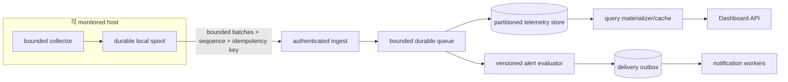

# Monitor 확장성·용량 분석

> 요구사항: Monitor.md 1-5, 11-1~9, 12-1~10, 15-6~12, 최종 감사 FA-35~49
> 기준 커밋: `3c2a0a8ae7d44154d2a5dee960315a72338c3ffc`
> 판정 기준일: 2026-08-30

## 결론

현재 Monitor는 **한 호스트에서 60초마다 고정 스키마 파일을 생성하고 같은 호스트의 단일 Node 프로세스가 동기식으로 읽는 구조**다. 그래서 지금 입증 가능한 용량은 “single host, one rootless Docker daemon, reviewed portfolio, low request concurrency”뿐이다. 다중 호스트·원격 agent·중앙 ingest·범용 로그·사용자 정의 규칙은 구현되지 않았으므로 그 처리량을 0 또는 미지원으로 기록한다.

아래 수치는 코드의 hard bound와 산술 추정이지 부하 시험 결과가 아니다. 저장소에는 목표 규모, p95 latency, RSS, write amplification, alert evaluation lag를 측정하는 load harness가 없다. 따라서 사용자 수나 EPS에 대해 안전 용량을 보증하지 않는다.

## SC-01 — 현재 용량 경계

| 대상 | 구현/상한 | 근거 | 운영 해석 | 판정 |
| --- | --- | --- | --- | --- |
| Host | 정확히 1개 local host | `ops/collector.py:4846-4878`은 hostname 기반 한 snapshot만 생성하며 host ID/등록 API가 없다. | 두 번째 host를 같은 데이터 디렉터리에 넣는 방식은 identity와 writer safety를 깨뜨린다. | 1 host만 구현 |
| Remote agent | 0개 | agent protocol, registration, heartbeat ingest endpoint, spool이 없다. | `collector-gap`은 local timer gap이지 network heartbeat가 아니다. | 미구현 |
| Docker daemon | `cks` 소유 rootless socket 1개 | `ops/container_exporter.py:22-38,56-59`; `ops/collector.py:1660-1664` | 다른 owner/daemon을 추가하는 것은 현재 privacy boundary 밖이다. | 1개만 구현 |
| Compose service label | 현재 emission allowlist 20개 | `ops/collector.py:142-167` | label cardinality는 bounded지만 replica instance identity는 공개 모델에서 소실된다. | 고정 cardinality |
| Container list | project 응답당 200, 전체 admitted entry 200 | `ops/collector.py:1671-1692` | 200은 성공 보장치가 아니라 fail-closed hard cap이다. | hard bound |
| Container stats | running container 최대 30개, worker 최대 6개 | `ops/collector.py:1694-1735` | 31번째 이후 running container는 state/health는 보일 수 있어도 CPU/memory가 `null`일 수 있다. | 부분 수집 |
| Host telemetry throughput | 60초마다 sample 1개, 즉 약 0.0167 sample/s | `ops/systemd/monitor-collector.timer:4-10`; `ops/collector.py:4883-4891` | 중앙 ingest rate가 아니라 local file append rate다. | 고정 저주기 |
| History retention | 일 2,000행, 기본 30일 → 논리상 최대 60,000행 | `README.md:539-547` | 기본 timer에서는 보통 약 1,440행/일이다. 2,000은 jitter/manual run 여유다. | bounded |
| Chart result | 최대 360 point | `server/data.ts:23,1536`; `README.md:652-660` | summary는 downsample 전 valid sample 전체를 순회한다. | response bounded |
| Operational event result | 종류별 최대 500행, incident 최대 500행 | `server/data.ts:24-25,1521-1546` | 서버는 파일 전체를 먼저 동기 parse한 뒤 결과를 줄인다. payload cap이 read cost를 제한하지 않는다. | 출력만 bounded |
| Incident storage | 최대 1,000행, 16 MiB, 30일 | `README.md:552-554`; `ops/collector.py:134-135` | burst가 크면 30일보다 먼저 record/byte cap으로 과거가 사라진다. | bounded |
| General alert rules | 0개 | rule store/CRUD/evaluator가 없다. | alert-rule throughput을 주장할 수 없다. | 미구현 |
| Built-in incident reasons | 7개, collector run당 1회 평가 | `ops/collector.py:115-118,4892-4904` | code-wired threshold이며 versioned rule pack이 아니다. | O(1), 확장 불가 |
| Generic log ingestion | 0 EPS | Docker stdout/journald/syslog/logfmt/multiline pipeline이 없다. | semantic selected-file reader를 범용 log throughput으로 계산하면 안 된다. | 미구현 |
| Semantic log scan window | 일반 source read당 1 MiB, kernel 8 MiB | `README.md:519-520`; `ops/collector.py:109-110` | scan byte cap일 뿐 무손실 EPS 보장이 아니다. burst/rotation 시 drop accounting도 없다. | 부분 구현 |
| Concurrent users | 측정값 없음 | load test가 없고 `server/data.ts:1478-1547`이 요청마다 동기 파일 read/parse를 수행한다. | “N명 지원”이라는 숫자를 제시할 증거가 없다. | 검증 불가 |
| Realtime connections | 0개 | SSE/WebSocket/tail route가 없다. | 재연결 폭주와 slow consumer 정책도 없다. | 미구현 |

## SC-02 — 요청당 비용과 주요 병목

### Dashboard API

30일 요청 하나는 최대 30개의 history file을 순차적으로 동기 read/parse한다. 각 파일 허용 크기는 8 MiB이므로 입력 검증이 허용하는 이론상 history read window는 약 240 MiB다. 여기에 `current.json` 1 MiB, 네 개의 4 MiB event file과 16 MiB incident file, JSON 문자열·배열·정규화 object가 추가된다(`server/data.ts:17-25,548-575,1478-1547`). 실제 collector가 정상적으로 쓰는 60,000행은 이보다 작지만, API와 writer limit이 서로 같은 상한을 강제하지 않는다.

Compose의 web container 제한은 256 MiB, 0.75 CPU, PID 128이다(`docker-compose.yml:31-40`). 따라서 “허용되는 크기의 파일”만으로도 동시 요청 없이 RSS limit에 근접하거나 넘을 가능성이 있다. Node event loop에서 sync I/O를 사용하므로 긴 30일 요청 하나가 `/readyz`를 제외한 다른 요청 latency를 밀어낼 수 있고, 동시 요청은 같은 파일을 중복 parse한다.

복잡도는 대략 다음과 같다.

- read/parse: `O(history bytes + event bytes)` per request
- sample normalize/sort/summary: `O(S log S)`; 정상 retention에서 `S <= 60,000`
- event normalize/sort: source별 `O(E log E)`; API 결과 cap은 sort 후 적용된다.
- cache, ETag 기반 materialization, pagination cursor, worker thread가 없다.

### Collector와 Docker exporter

한 collector run의 proc/sys/statvfs는 host 규모에 비례한다. process 집계는 허용 UID의 `/proc` entry 수에 비례하고 internal state는 8,192 entry로 제한된다(`ops/collector.py:119-123`). Docker list query는 allowlisted project별로 **순차** 실행하며 각 curl timeout 기본 2초다. 그 뒤 최대 30개의 stats query만 최대 6 worker로 실행한다(`ops/collector.py:1554-1570,1665-1735`). project query 지연이 stats용 20초 deadline을 소비할 수 있다.

`monitor-collector.service`는 exporter를 `Requires`/`After`로 묶는다(`ops/systemd/monitor-collector.service:4-12`). Docker socket 지연·권한 실패가 container 데이터만 degraded시키는 대신 host sample 전체를 지연 또는 실패시킬 수 있다. 이는 capacity 문제와 availability problem을 결합한다.

### 파일 저장소

일자 partition과 bounded rewrite는 한 호스트에서 단순하고 복구하기 쉽다. 반면 다음 기능은 없다.

- host/tenant/metric partition key와 index
- query planner, compaction manifest, chunk checksum inventory
- concurrent writer arbitration 또는 distributed lease
- multi-resolution rollup
- storage queue/backpressure/drop counter
- 전체 export의 backup/clean-host restore proof

따라서 DB index나 N+1 query는 현재 **해당 없음**이다. 대신 N개 파일을 매 요청마다 읽는 “filesystem N-scan”이 동일한 역할의 병목이다. SQLite/TSDB를 도입하기 전까지 “index 최적화 완료”로 판정하지 않는다.

## SC-03 — 데이터량 추정

| 부하 축 | 현재 산식 | 1일/30일 추정 | 주의 |
| --- | --- | --- | --- |
| Host sample | 1 row/minute | 약 1,440 / 43,200 rows; hard cap 2,000 / 60,000 | 수동 재실행, timer jitter, gap에 따라 달라진다. |
| API sample scan | range 내 모든 valid row | 30일 정상치 약 43,200 row를 normalize/summary 후 360 point로 축약 | 출력 360이 입력 scan 360을 뜻하지 않는다. |
| Container observation | 최대 200 row/minute, stats 최대 30 row/minute | list 최대 288,000 row-observations/day; stats 최대 43,200/day | 매 분 snapshot에만 있고 container history series는 별도 저장하지 않는다. |
| Incident evidence | transition/follow-up/recovery 시 append | 최대 1,000 retained rows와 16 MiB | 발생률이 높으면 retention duration이 단축된다. |
| Semantic events | source별 bounded export | fixed record caps, 보장 EPS 없음 | scan window를 초과한 입력과 rotation에 대한 loss metric이 없다. |
| Generic logs | 없음 | 0 | P1 pipeline 전에는 규모 산정을 적용할 대상이 없다. |
| Alert evaluations | 7 code reasons × collector run | 최대 약 10,080 reason checks/day | evaluator latency, missed interval, per-rule state metric이 없다. |

이 계산은 serialized row byte size를 고정하지 않는다. 실제 byte/row, filesystem write amplification, fsync latency, Pi SD-card wear는 benchmark로 측정해야 한다.

## SC-04 — architecture와 Raspberry Pi 영향

| 환경 | 현재 증거 | 확장성 영향 | 필요한 gate |
| --- | --- | --- | --- |
| Ubuntu arm64 | CI runner와 image build가 arm64다(`.github/workflows/deploy.yml:24-25,76-88`). | 현재 가장 강한 build 증거지만 실제 Pi proc/sys/SD I/O 부하는 재현하지 않는다. | arm64 container smoke + Pi fixture + 실제 Pi scheduled soak |
| Ubuntu amd64 | Python/TypeScript source는 architecture-neutral하나 CI image gate가 없다. | parser 차이보다 packaging/native transitive dependency와 image manifest 누락 위험이 크다. | amd64 test/image/health gate와 동일 digest provenance |
| Raspberry Pi | temperature, voltage, throttled flags 일부가 optional이다. collector 192 MiB, exporter 160 MiB limit이 있다. | 저속 SD의 rewrite/fsync, 낮은 CPU, thermal throttle에서 60초 deadline과 API sync parse가 더 취약하다. | Pi 4/5 또는 대표 arm64 hardware에서 CPU/RSS/write/thermal soak |
| cgroup v1/v2 | host proc/pressure 및 Docker stats 값을 읽지만 명시적 matrix load test가 없다. | memory limit/CPU percent 의미가 runtime/cgroup에 따라 달라질 수 있다. | v1/v2 fixture와 constrained-container integration |
| Rootless Docker | exact socket/UID로 격리되어 있다. | 안전하지만 one-daemon assumption이 scaling ceiling이다. | 추가 daemon은 별도 identity/token/privacy design 후만 허용 |

systemd 제한(`collector MemoryMax=192M`, exporter `160M`)과 Compose 제한(`256m`)은 fail-fast guard이지 성능 목표를 만족했다는 증거가 아니다. OOM으로 종료될 때 stale/source-failed를 명확히 나타내는 상태 모델도 현재 없다.

## SC-05 — 확장 방향 제안

아래 구조는 **미구현 제안**이다. 현재 파일 경계를 보존하면서 각 단계를 독립적으로 검증하기 위한 방향이다.



권장 partition은 telemetry에 `hostId + UTC time bucket`, metadata에 stable entity ID다. raw PID/container ID/request path를 series label로 쓰지 않는다. agent batch에는 `agentId`, installation epoch, first/last sequence, observed/received time, schema version, checksum과 compression limit을 둔다. queue가 가득 차면 정책에 따라 오래된 high-resolution sample을 rollup하거나 명시적으로 drop하되 `droppedCount`를 영속해야 한다.

단일-host local mode는 중앙 ingest 장애 시에도 유지한다. multi-host 단계는 local writer를 제거하는 방식이 아니라 spool dual-write/read-compare 후 전환해야 한다.

## SC-06 — 우선순위별 병목 해소

| ID | 우선순위 | 위험과 재현 | 구현 slice | 검증 시험 | 완료 조건 |
| --- | --- | --- | --- | --- | --- |
| SC-P0-01 | P0 | 30일 API 요청을 허용 최대 크기 history fixture로 반복하면 sync parse가 event loop/RSS를 압박한다. | writer/API file cap 일치, request budget, precomputed summary, conditional cache 또는 worker isolation | 1×/2× target dataset에서 1/10/50 concurrency, p50/p95/p99/RSS/event-loop delay | 256 MiB/0.75 CPU budget 안에서 versioned SLO를 만족하고 초과 요청은 bounded error로 끝난다. |
| SC-P0-02 | P0 | Docker project query를 timeout 직전까지 지연하면 stats가 빠지고 collector 전체가 exporter dependency에 묶인다. | exporter/source status 분리, bounded parallel project list, per-stage/global deadline, last-good snapshot age | slow/hung/permission-denied/socket-restart fake daemon, 30/31/200/201 container | host sample은 계속 기록되고 container source가 typed degraded가 되며 deadline을 넘지 않는다. |
| SC-P0-03 | P0 | load harness가 없어 “사용자/host/rule 용량” 숫자를 검증할 수 없다. | target profile과 2× profile, metrics artifact, regression threshold를 CI/scheduled job에 추가 | API, collector, evaluator, delivery queue, reconnect storm workload | target/p95/RSS/write/alert-lag budget이 코드와 함께 versioned되고 gate 실패를 skip할 수 없다. |
| SC-P0-04 | P0 | event file cap은 있지만 burst drop/retention 축소를 알 수 없다. | source별 attempted/accepted/redacted/sampled/dropped counters와 oldest/newest retained time | 100k-line storm, oversize/multiline/rotation/ENOSPC | loss가 수치로 노출되고 telemetry와 alert evaluation이 log storm과 격리된다. |
| SC-P0-05 | P0 | amd64 artifact가 없어 architecture-neutral claim을 실행 증거로 만들 수 없다. | amd64/arm64 build-test matrix, multiarch manifest, SBOM/provenance | 두 platform image health/API/collector fixture, manifest digest readback | 양 platform digest와 SBOM이 release artifact에 있고 동일 contract suite가 통과한다. |
| SC-P0-06 | P0 | Pi에서 sync history read와 rewrite/fsync가 SD wear·thermal throttle을 키울 수 있다. | write/RSS/CPU/duration self-metrics, rewrite 최소화, stage deadline | Pi 대표 hardware 24h soak, thermal throttle, slow filesystem, reboot | collection interval miss와 write budget이 정의된 한도 내이고 crash 후 corruption/loss가 없다. |
| SC-P1-01 | P1 | 두 번째 host는 identity/ingest가 없어 저장할 수 없다. | stable host/agent identity, bounded spool, idempotent batch ingest, partitioned store | 1/10/100 host simulation, offline replay, duplicate/reorder, token revoke | 목표 host 수와 2× burst에서 no cross-host merge, bounded lag/RSS, measured RPO를 만족한다. |
| SC-P1-02 | P1 | 사용자 정의 rule 증가 시 현재 collector inline 평가를 확장할 모델이 없다. | evaluator worker partition, versioned compiled rule cache, per-rule cost limit | 82 default + target custom rules, missing data, expensive selector rejection | evaluation p99/lag가 interval보다 작고 한 rule이 전체 worker를 고갈시키지 않는다. |
| SC-P1-03 | P1 | 범용 log search/tail이 없다. | separate log storage/index, retention tier, cursor pagination, SSE backpressure | target/2× EPS, slow clients, reconnect storm, masking verification | ingestion loss/drop SLO, query p95, retention와 secret-before-storage 조건을 충족한다. |
| SC-P2-01 | P2 | 장기 range는 30일 fixed raw scan뿐이다. | hourly/daily rollup과 resolution-aware query | raw↔rollup count/min/max/sum read-compare, late sample correction | 장기 query가 raw 전체를 읽지 않고 정의된 오차·correction window를 만족한다. |

## SC-07 — 용량 시험 계약

구현 전 product target을 숫자로 합의해야 한다. 최소 시험 manifest는 다음 필드를 version control에 둔다.

```text
hosts, agents_per_host, containers_per_daemon, samples_per_second,
semantic_events_per_second, log_bytes_per_second, alert_rules,
concurrent_users, dashboard_range_mix, reconnects_per_second,
retention_days, architecture, cgroup_mode, storage_class
```

각 run은 API latency와 error rate, collector/exporter duration, RSS/CPU, bytes read/written/fsynced, event-loop delay, ingest/evaluator lag, queue depth, dropped/duplicate/out-of-order count, notification latency를 artifact로 남겨야 한다. 정상 target뿐 아니라 최소 2배 burst, slow storage, Docker hang, network loss, ENOSPC, clock skew를 포함한다.

## 완료 판정

확장성 요구사항을 완료로 표시하려면 다음이 모두 필요하다.

1. 구현 가능한 host/container/rule/log/user 목표와 2배 burst가 숫자로 versioned되어 있다.
2. amd64와 arm64, cgroup v1/v2, 대표 Raspberry Pi 또는 동등한 resource-constrained arm64 환경에서 같은 contract가 실행된다.
3. API p95/p99, RSS, CPU, write volume, collection/evaluation/delivery lag와 drop budget이 자동 gate다.
4. source 하나의 지연·폭증·권한 실패가 host telemetry와 다른 source를 중단시키지 않는다.
5. multi-host batch는 duplicate/out-of-order/offline replay에 idempotent하고 spool overflow가 관측 가능하다.
6. 장기 query는 raw file 전체 scan에 의존하지 않으며 cache/rollup 결과가 원본과 read-compare된다.
7. 부하 시험이 없는 숫자는 capacity 보증으로 문서화하지 않는다.
